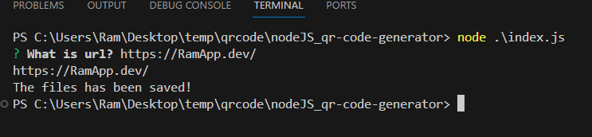

# QR Code Generator Using NodeJS

## Description 
Simple NodeJs Application for Generating QR code of URL entered by user and saving URL and QR code image in files

## Installation 
simply code this repo in your IDE and run 
"npm install"
"node .\index.js"

## Contact Info
GitHub profile :- https://github.com/RamG222 Email :- shriramgupta8141@gmail.com

## Screenshot
Terminal Screenshot

Output file in PNG format

